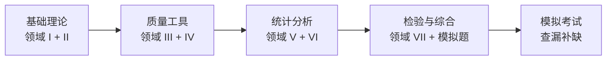

# CQE 认证备考（ASQ 注册质量工程师）

ASQ（American Society for Quality，美国质量学会）的 **CQE**（Certified Quality Engineer，注册质量工程师）认证是全球公认的质量工程领域专业认证。

## 考试概述

| 项目 | 内容 |
|------|------|
| **认证名称** | Certified Quality Engineer（CQE） |
| **发证机构** | ASQ（美国质量学会） |
| **考试时长** | 5 小时 |
| **题目数量** | 160 道选择题 |
| **及格分数** | 通常约 550–600 分（满分 750 分） |
| **考试语言** | 英文（另有中/日/韩等其他语言版本） |
| **考试形式** | 机考（Pearson VUE）或纸笔考试 |
| **有效期** | 三年（需通过 Recertification 续证） |
| **费用** | ASQ 会员约 \$398，非会员约 \$528（以官方最新为准） |

### 报考条件

| 学历 | 质量相关工作经验 |
|------|----------------|
| 高中/中专 | 8 年 |
| 大专 | 6 年 |
| 本科 | 4 年 |
| 硕士/博士 | 3 年 |

> 如果已获得其他 ASQ 认证（如 CQT、CMI），部分经验可折算抵免。

## 考试大纲七大领域

ASQ CQE 考试分为 **7 大领域（Body of Knowledge）**，各领域的权重如下：

### 领域 I：管理与领导力（Management & Leadership）— 约 15 题

- 质量理念与体系（全面质量管理、持续改进）
- 质量文化与变革管理
- 领导力与团队建设（组织理论、激励理论）
- 供应商管理（评估、开发、审核）
- 项目管理基础

**备考重点**：Deming 14 条、Juran 三部曲、Crosby 零缺陷、组织变革模型（Kotter 8 步法等）。

### 领域 II：质量体系开发与实施（Quality System）— 约 15 题

- ISO 9001 系列标准
- 第三方审核与内部审核
- 质量手册与成文信息
- 质量成本（COQ）：预防成本、鉴定成本、内部故障、外部故障

**备考重点**：COQ 分类、审核类型（一/二/三方）、质量体系文件金字塔。

### 领域 III：产品与过程设计（Product & Process Design）— 约 25 题

- 设计和开发流程（APQP、Gate Review）
- FMEA（DFMEA / PFMEA）
- 可靠性与可维护性
- 设计评审与验证/确认

**备考重点**：FMEA 的 RPN 计算、可靠性指标（MTBF、MTTR、浴盆曲线）。

### 领域 IV：质量管理方法（Quality Methods）— 约 30 题

- **QC 七大手法**：柏拉图、因果图、直方图、控制图、散布图、层别法、检查表
- 新 QC 七大手法：亲和图、关联图、树图、矩阵图、优先矩阵、PDPC、网络图
- 过程能力分析（Cp、Cpk、Pp、Ppk）
- 过程性能与规格的关系

**备考重点**：Cp/Cpk 计算、过程能力指数与 ppm 的换算。

### 领域 V：统计基础与分析（Statistical Methods）— 约 30 题

- 概率论基础（正态分布、二项分布、泊松分布）
- 描述统计（均值、中位数、标准差、四分位距）
- 推断统计：
  - 假设检验（t 检验、F 检验、卡方检验）
  - 置信区间
  - ANOVA（方差分析）
- DOE（实验设计）：因子设计、部分因子、全因子
- 相关与回归分析

**备考重点**：假设检验流程、p-value 解读、单因素 vs 双因素 ANOVA、2^k 因子设计。

### 领域 VI：过程控制（Process Control）— 约 20 题

- SPC 与控制图：
  - 计量型：X̄-R、X̄-S、I-MR
  - 计数型：p、np、c、u
- 控制图的判异准则（Western Electric Rules、Nelson Rules）
- 过程能力研究

**备考重点**：控制限计算公式、判异规则、CPK 与 PPK 的区别。

### 领域 VII：检验与测试（Inspection & Testing）— 约 10 题

- 检验计划与抽样方案（ANSI/ASQ Z1.4、Z1.9）
- 计量型与计数型抽样
- MSA 与 GRR 分析
- 量具校准与追溯

**备考重点**：AQL 与抽样方案的选择、GRR 计算与判定标准（%GRR ≤ 10%）。

### 各领域占比示意图

```
领域 I:  管理与领导力        ████████░░░░░░  约 15 题  (10%)
领域 II: 质量体系             ████████░░░░░░  约 15 题  (10%)
领域 III:产品与过程设计       ████████████░░  约 25 题  (15%)
领域 IV: 质量管理方法         ██████████████  约 30 题  (20%)
领域 V:  统计方法             ██████████████  约 30 题  (20%)
领域 VI: 过程控制             ██████████░░░░  约 20 题  (12%)
领域 VII:检验与测试           █████░░░░░░░░░  约 10 题  (7%)
```

> **统计相关（领域 IV + V + VI）合计占约 50 题（30%+），是考试的重中之重。**

## 备考建议

### 学习路径



### 时间规划

| 阶段 | 时长 | 内容 |
|------|------|------|
| 基础学习 | 2–3 个月 | 通读教材，理解概念 |
| 专题突破 | 2 个月 | 重点攻克统计、SPC、FMEA |
| 刷题巩固 | 1 个月 | 做模拟题，分析错题 |
| 冲刺复习 | 2 周 | 全真模考，查漏补缺 |
| **总计** | **5–6 个月** | |

### 推荐书籍

| 书名 | 作者/出版社 | 推荐理由 |
|------|------------|---------|
| **The Certified Quality Engineer Handbook** | ASQ Quality Press | CQE 考试官方首选参考书 |
| **Quality Engineering Handbook** | Thomas Pyzdek | 经典教材，内容系统全面 |
| **Juran's Quality Handbook** | Joseph M. Juran | 质量领域的"圣经" |
| **Statistics for Quality** | ASQ | 统计专项突破用书 |
| **CQE 模拟试题集** | 各大备考网站 | 刷题查漏补缺 |

### 推荐学习资源

| 资源 | 说明 |
|------|------|
| [ASQ 官网](https://asq.org) | 考试大纲、样题、报名 |
| ASQ 分会研讨会 | 线下学习小组，交流经验 |
| LinkedIn CQE 组群 | 备考经验分享与答疑 |
| Quizlet CQE 词卡 | 碎片时间记忆概念 |
| 本网站模拟试题 | [点击进入](./mock-exam) |

### 考试当天 Tips

- **时间分配**：160 题 / 300 分钟 ≈ **每道题 1 分 50 秒**
- **做题顺序**：先做熟悉的统计和工具题，留出时间给复杂的计算
- **标记策略**：不确定的题先标记（Mark），最后再回看
- **携带物品**：
  - 计算器（ASQ 允许的型号，如 TI-30X 系列）
  - 身份证件（含照片的官方 ID）
  - ASQ 会员卡（如有）
- **注意**：考试不允许携带自己的参考书或笔记

## 常见问题

### Q: 考试是开卷还是闭卷？

A: **闭卷**。不允许携带任何参考材料。考场提供草稿纸和笔。

### Q: 需要记住公式吗？

A: 复杂的公式不需要死记硬背，控制系统会给出公式参考表。但建议熟练掌握常用公式（如 Cp/Cpk、控制限、DPMO 等）的运用，以节省查表时间。

### Q: 第一次没通过怎么办？

A: 可在 12 个月后重新报考。建议分析成绩报告（各领域的得分率），针对薄弱环节重点复习。

### Q: ASQ CQE 在国内认可吗？

A: **认可度较高**。许多外资企业、汽车行业（尤其是合资 OEM）和大型制造企业将 CQE 作为质量工程师的重要资质加分项。

## 相关链接

- [六西格玛绿带/黑带认证](./six-sigma-belt)
- [模拟试题](./mock-exam)
- [ISO 9001 质量管理体系](/standards/)
- [SPC 统计过程控制](/tools/spc)
- [FMEA 失效模式分析](/tools/fmea)
