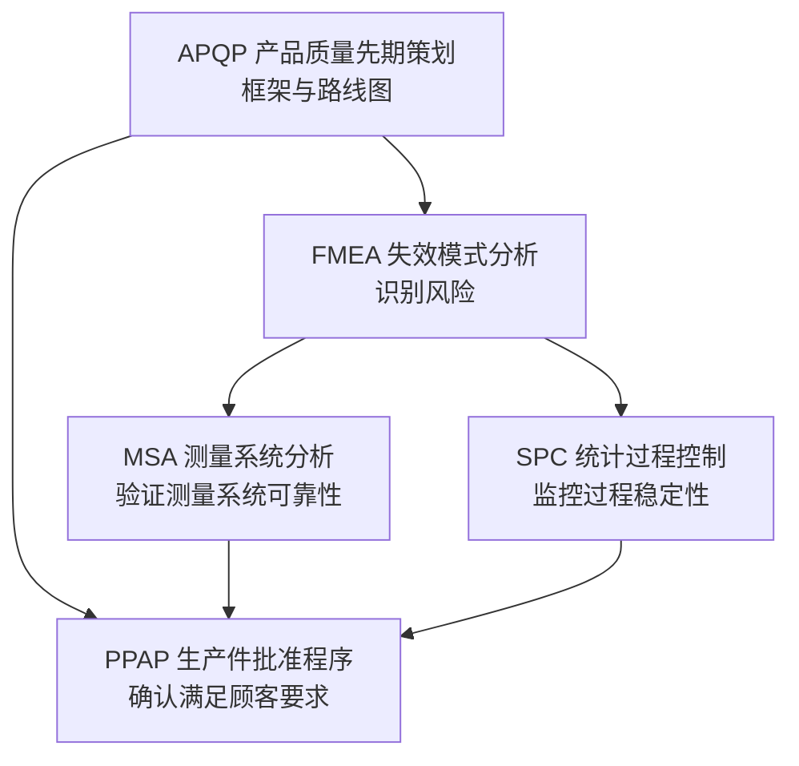

# IATF 16949 汽车行业质量管理体系

IATF 16949 是由国际汽车工作组（International Automotive Task Force, IATF）发布的汽车行业质量管理体系标准，以 ISO 9001:2015 为基础，增加了汽车行业特有的补充要求。

## 标准概述

| 项目 | 内容 |
|------|------|
| **全称** | IATF 16949:2016 — 汽车行业质量管理体系 |
| **发布机构** | IATF（国际汽车工作组） |
| **基础标准** | ISO 9001:2015 |
| **适用范围** | 汽车供应链中的零部件、材料、热处理/涂装等加工服务的制造厂 |
| **有效期** | 证书有效期 3 年，需每年接受监督审核 |

## 与 ISO 9001 的关系

IATF 16949 **不是独立的标准**，而是 ISO 9001 的**补充标准**：

```
ISO 9001:2015 + 汽车行业特殊要求 = IATF 16949:2016
```

- 所有 ISO 9001:2015 的要求都已包含在 IATF 16949 中
- IATF 16949 对每个 ISO 9001 条款增加了额外的汽车行业要求
- 获得 IATF 16949 认证即自动满足 ISO 9001 的要求
- 认证审核必须同时覆盖 ISO 9001 和 IATF 16949 的全部要求

### 主要补充要求

| ISO 9001 条款 | IATF 16949 补充要点 |
|--------------|-------------------|
| 4.1 组织环境 | 增加产品安全相关的组织角色确定 |
| 5.1 领导作用 | 明确企业责任人对质量体系有效性的责任，含顾客特定要求 |
| 6.1 风险应对 | 应急计划含：关键设备故障、公用事业中断、IT 系统崩溃、供方交付问题等 |
| 7.1 资源 | 包含工厂布局、过程有效性分析、污染控制 |
| 7.2 能力 | 特定岗位能力要求（含内部审核员、第二方审核员） |
| 8.3 产品设计 | 特殊特性识别（CC/SC）、DFM/DFA、FMEA |
| 8.4 外部提供 | 供应商开发、供应商监视、PPAP 要求 |
| 8.5 生产提供 | **五大核心工具**全面应用 |
| 9.2 内部审核 | 质量管理体系审核、制造过程审核、产品审核 |
| 10.2 改进 | 问题解决流程、防错方法 |

## CSR（顾客特定要求）

**CSR**（Customer-Specific Requirements，顾客特定要求）是 IATF 16949 的核心特色之一：

- 每个 OEM（如大众、福特、通用、丰田等）都有自己的一套 CSR
- 组织必须识别并满足所有顾客的 CSR
- CSR 通常包括：供应商管理要求、PPAP 等级、实验室要求、包装运输规范等
- CSR 可以增强、删除或修改 IATF 16949 的某些要求

### 常见 OEM 的 CSR 举例

| OEM | 典型 CSR |
|-----|---------|
| Volkswagen | VW 标准，Formel Q 供应商质量管理体系 |
| Ford | Ford 特定要求（FDS）、Q1 认证 |
| GM | BIQS（Global Built In Quality Supply Base） |
| Toyota | 供应商质量保证手册 |
| BMW | BMW 特定供应商质量要求 |

## 五大核心工具的联系

IATF 16949 强制要求在产品和过程开发中应用**五大核心工具**：



### 1. APQP（产品质量先期策划）

- **目的**：确保产品开发满足顾客要求，避免量产后的设计变更
- **五个阶段**：
  1. 项目策划与定义
  2. 产品设计与开发
  3. 过程设计与开发
  4. 产品与过程确认
  5. 反馈、评定与纠正措施
- **输出物**：BOM、过程流程图、PFMEA、控制计划、MSA 计划、初始过程能力研究等

### 2. FMEA（失效模式与影响分析）

- **目的**：识别潜在的失效模式，评估风险并制定预防措施
- **类型**：
  - **DFMEA**（设计 FMEA）：聚焦产品设计缺陷
  - **PFMEA**（过程 FMEA）：聚焦制造过程缺陷
- IATF 16949 要求 FMEA 必须按照顾客要求或采用 AIAG-VDA FMEA 手册

### 3. MSA（测量系统分析）

- **目的**：评估测量系统的变异，确保测量数据可靠
- **常用指标**：
  - **GRR**（量具重复性和再现性）：通常要求 %GRR ≤ 10% 合格，10–30% 有条件接受，>30% 不合格
  - **偏倚（Bias）**、**线性（Linearity）**、**稳定性（Stability）**

### 4. SPC（统计过程控制）

- **目的**：通过控制图监控过程的稳定性，及时发现异常
- **常用类型**：
  - 计量型：X̄-R 图、X̄-S 图、I-MR 图
  - 计数型：p 图、np 图、c 图、u 图
- IATF 16949 要求：初始过程能力研究（CPK ≥ 1.67），量产过程能力（CPK ≥ 1.33）

### 5. PPAP（生产件批准程序）

- **目的**：在新产品或过程变更前，向顾客证明所有工程设计和规格要求都已满足
- **五个等级**（Level 1–5），通常使用 **Level 3**（提交全部文件和样品）
- **18 项提交要素**：设计记录、工程变更文件、DFMEA、PFMEA、控制计划、MSA 报告、初始过程能力研究、外观批准报告（AAR）等

### 五大工具的关系总结

| 工具 | 阶段 | 核心输出 |
|------|------|---------|
| APQP | 策划 | 项目计划、BOM、过程流程图、控制计划 |
| FMEA | 风险识别 | DFMEA/PFMEA，决定控制措施和防错方案 |
| MSA | 测量验证 | GRR、偏倚、线性、稳定性报告 |
| SPC | 过程监控 | 控制图、过程能力指数（CPK/PPK） |
| PPAP | 批准确认 | 提交保证书（PSW）、全套 18 项文件 |

## 特殊特性（Special Characteristics）

IATF 16949 强调特殊特性的识别和管理：

- **CC**（Critical Characteristic，关键特性）— 影响安全或法规符合性
- **SC**（Significant Characteristic，重要特性）— 影响功能、装配或性能
- 需在 FMEA、控制计划、作业指导书上标识特殊特性符号
- 常见标识符号：&#x2716;（安全/法规）、&#x25A0;（重要）

## 产品安全

IATF 16949 增加了产品安全的专项要求（条款 4.4.1.2）：

- 组织应确定与产品安全相关的产品和过程
- 建立文档化的产品安全过程
- 涉及产品安全的变更需通知顾客
- 产品安全相关培训需特别记录

## 相关链接

- [ISO 9001:2015 质量管理体系](./)
- [FMEA 失效模式分析](/tools/fmea)
- [SPC 统计过程控制](/tools/spc)
- [MSA 测量系统分析](/tools/msa)
- [PPAP 生产件批准程序](/tools/ppap)
- [六西格玛方法论](./six-sigma)
