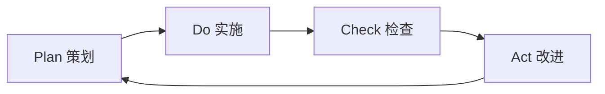
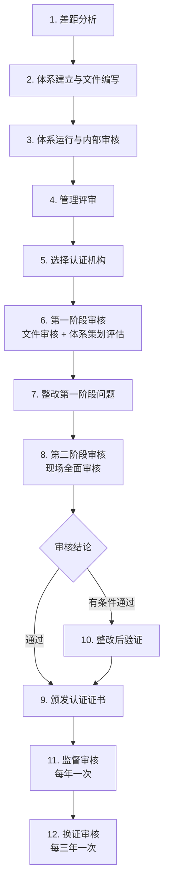

# ISO 9001:2015 质量管理体系

ISO 9001:2015 是国际标准化组织（ISO）发布的质量管理体系（QMS）标准，适用于任何行业和规模的组织。它是全球应用最广泛的质量管理标准。

## 七大质量管理原则

ISO 9001:2015 建立在以下七项质量管理原则之上：

| 原则 | 说明 |
|------|------|
| **1. 以顾客为关注焦点** | 组织应理解并满足顾客当前和未来的需求，超越顾客期望。 |
| **2. 领导作用** | 各级领导者应建立统一的质量方针和质量目标，营造良好的内部环境。 |
| **3. 全员参与** | 全员胜任、授权并积极参与，是实现质量目标的关键。 |
| **4. 过程方法** | 将活动作为相互关联的过程来管理，有助于高效实现预期输出。 |
| **5. 改进** | 持续改进是组织保持绩效的必要条件。 |
| **6. 循证决策** | 基于数据和信息的分析进行决策，更加客观、可靠。 |
| **7. 关系管理** | 与供方等相关方建立互利关系，提升创造价值的能力。 |

## PDCA 循环

ISO 9001:2015 采用 **PDCA 循环**（Plan-Do-Check-Act）作为过程方法的核心框架：

- **Plan（策划）**：设定质量目标，识别风险和机遇，制定过程和控制措施。
- **Do（实施）**：按照计划执行过程。
- **Check（检查）**：监视和测量过程及产品，对照方针、目标和要求报告结果。
- **Act（改进）**：采取措施持续改进过程绩效。

## 基于风险的思维

ISO 9001:2015 引入了 **基于风险的思维**（Risk-Based Thinking），取代了预防措施的单独条款：

- 风险不一定是负面的——机遇也被视为一种风险。
- 组织应识别影响 QMS 目标达成的风险和机遇。
- 策划质量体系时，需制定应对风险和利用机遇的措施。
- 风险分析可以简单（如头脑风暴）或复杂（如 FMEA），视组织环境而定。

## 条款 0–10 章节结构

ISO 9001:2015 采用 **HLS（High-Level Structure）** 高阶架构，共 10 个条款：

| 条款 | 标题 | 内容概要 |
|------|------|---------|
| 0–3 | 引言、范围、引用标准、术语 | 标准基础信息 |
| **4** | **组织环境** | 理解组织及其环境、相关方需求、QMS 范围、过程方法 |
| **5** | **领导作用** | 领导承诺、质量方针、角色与职责 |
| **6** | **策划** | 应对风险和机遇的措施、质量目标及其实施策划、变更策划 |
| **7** | **支持** | 资源、能力、意识、沟通、成文信息 |
| **8** | **运行** | 运行策划与控制、产品和服务要求、设计和开发、外部提供、生产和交付、不合格输出 |
| **9** | **绩效评价** | 监视、测量、分析和评价、内部审核、管理评审 |
| **10** | **改进** | 不符合与纠正措施、持续改进 |

> **第 4–10 条是审核的重点条款**，其中第 6 条（策划）和第 8 条（运行）是审核中发现问题最多的区域。

## 认证流程

企业获得 ISO 9001 认证的一般流程：

### 认证周期示例

| 阶段 | 预估时间 |
|------|---------|
| 体系建立与运行 | 3–6 个月 |
| 内部审核与管理评审 | 1–2 个月 |
| 认证审核（两阶段） | 1–2 个月 |
| **总计** | **6–12 个月** |

## 主要变化：ISO 9001:2015 vs ISO 9001:2008

| 项目 | ISO 9001:2008 | ISO 9001:2015 |
|------|--------------|--------------|
| 条款结构 | 8 个条款 | 10 个条款（HLS 架构） |
| 预防措施 | 单独条款 (8.5.3) | 融入基于风险的思维 (6.1) |
| 成文信息 | 文件化程序 + 记录 | 成文信息（更灵活） |
| 管理者代表 | 要求指定 | 不再强制要求 |
| 质量手册 | 要求编写 | 不再强制要求独立手册 |

> **提示**：ISO 9001:2015 强调灵活性和适应性，不再强制要求质量手册和文件化程序，而是让组织根据自身情况决定成文信息的范围。

## 相关链接

- [IATF 16949 汽车行业质量管理体系](./iatf-16949)
- [六西格玛方法论](./six-sigma)
- [精益生产](./lean-production)
- [CQE 认证备考](/certification/)
