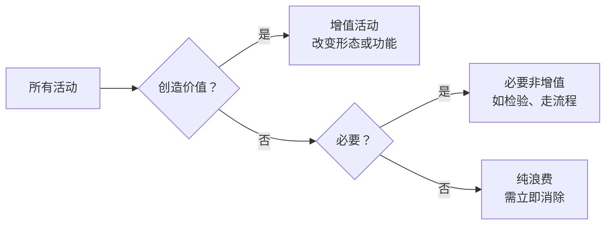
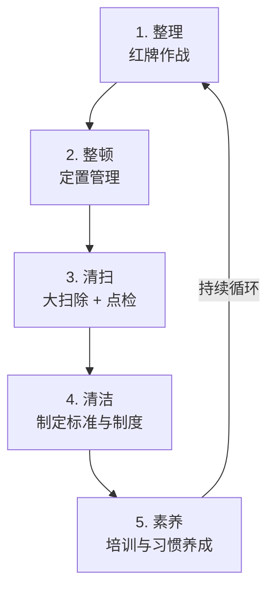
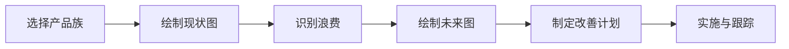

# 精益生产（Lean Production）

精益生产起源于丰田生产系统（Toyota Production System, TPS），核心理念是**消除一切浪费、持续改善、创造价值**。其目标是以最少的资源投入，在最短的时间内提供顾客满意的产品。

## 七大浪费（TIMWOOD）

精益生产定义了七种核心浪费（也称 Muda），采用助记词 **TIMWOOD**：

| 缩写 | 浪费类型 | 英文 | 示例 |
|------|---------|------|------|
| **T** | 运输浪费 | Transport | 物料不必要的搬运、远距离运输 |
| **I** | 库存浪费 | Inventory | 过多的原材料、在制品、成品库存 |
| **M** | 动作浪费 | Motion | 员工转身、弯腰、行走等不创造价值的动作 |
| **W** | 等待浪费 | Waiting | 等待物料、设备、信息、批准 |
| **O** | 过度加工浪费 | Over-processing | 超出顾客要求的加工精度或工序 |
| **O** | 过量生产浪费 | Over-production | 生产超出顾客需求的数量或过早生产 |
| **D** | 缺陷浪费 | Defects | 返工、报废、检查等由缺陷引起的成本 |

> 后期还增加了第 8 种浪费——**人才浪费**（未充分利用员工的创意和能力），形成 TIMWOODS。

### 浪费与增值活动



**精益的目标**：消除纯浪费，减少必要非增值活动，最大化增值活动比例。

## 5S 现场管理

5S 是精益生产的基石，是创造有序、高效、安全工作环境的方法：

### 5S 的定义

| 日语 | 中文 | 英文 | 核心要点 |
|-----|------|------|---------|
| **整理**<br/>Seiri | 整理 | Sort | 区分要与不要，清除无用物品 |
| **整顿**<br/>Seiton | 整顿 | Set in Order | 物归其位，标识清晰，取用方便 |
| **清扫**<br/>Seiso | 清扫 | Shine | 彻底清洁工作场所，发现异常 |
| **清洁**<br/>Seiketsu | 清洁 | Standardize | 标准化，维持前 3S 的成果 |
| **素养**<br/>Shitsuke | 素养 | Sustain | 养成习惯，持续遵守，形成文化 |

### 5S 的实施步骤



### 5S 的实施要点

- **整理**：采用"红牌作战"——将不需要的物品贴上红牌，集中处理
- **整顿**：采用"目视化管理"和"形迹管理"——每个物品有固定位置和标识
- **清扫**：同时是检查过程，发现漏油、松动等异常及时处理
- **清洁**：建立 5S 检查标准和评分制度
- **素养**：通过晨会、培训、评比等方式将 5S 内化为员工习惯

## Kaizen（持续改善）

**Kaizen**（改善）是精益生产的核心哲学——"每天进步一点点"。

### Kaizen 的原则

| 原则 | 说明 |
|------|------|
| **打破现状** | 即使没有明显问题，也要寻找改进机会 |
| **过程导向** | 关注过程改善，而非只关注结果 |
| **全员参与** | 一线员工最了解问题，鼓励全员提出改善建议 |
| **低成本改善** | 优先使用常识和创意，而非大量投资 |
| **立即行动** | 改善无需完美，今天能做的不要等到明天 |

### Kaizen 与 Kaizen Blitz

- **Kaizen**：日常性、持续的改善活动（每天的小改善）
- **Kaizen Blitz**（改善突击）：集中 3–5 天对特定区域进行大刀阔斧的改善

### Kaizen 的实施流程

```
1. 发现问题（现场观察、员工提案）
2. 分析现状（数据收集）
3. 根本原因分析（5 Why、鱼骨图）
4. 制定改善方案
5. 实施改善
6. 验证效果
7. 标准化（新标准作业）
8. 推广
```

## JIT（准时制生产）

**JIT**（Just-In-Time）的核心思想是"在需要的时候，按需要的数量，生产需要的产品"。

### JIT 的三大要素

| 要素 | 说明 |
|------|------|
| **拉动式生产** | 后工序仅在被需要时向前工序取料（Pull System） |
| **单件流** | 尽可能实现单件流动，缩短生产周期 |
| **节拍时间（Takt Time）** | 按顾客需求速度生产 |

```
Takt Time = 可用工作时间 ÷ 顾客需求数量
```

### JIT 的前提条件

- 稳定的生产过程（低变异）
- 快速的换模换线（SMED）
- 多技能工（多能工）
- 可靠的设备维护（TPM）
- 高质量的来料（零缺陷思想）

## 看板系统（Kanban）

看板是 JIT 的信息传递工具，用于控制生产和物料的流动。

### 看板的类型

| 类型 | 用途 |
|------|------|
| **生产看板** | 指示前工序生产的数量和顺序 |
| **领取看板** | 指示后工序领取物料的种类和数量 |
| **信号看板** | 用于批量生产工序的触发信号 |

### 看板的使用规则

1. 后工序只在需要时向前工序领取
2. 前工序只生产后工序领取的数量
3. 不合格品不送到后工序
4. 看板数量应逐步减少（持续改善）
5. 看板必须伴随实物

```
看板张数 = (平均需求 × 生产提前期 + 安全库存) ÷ 单箱容量
```

## 价值流图（VSM）

**VSM**（Value Stream Mapping，价值流图）是精益改善的核心分析工具，端到端可视化从原材料到成品的物料流和信息流。

### VSM 的标准符号

| 符号 | 含义 |
|------|------|
| 过程框 | 制造或信息处理过程 |
| 三角形 | 库存/缓冲区 |
| 闪电箭头 | 信息流（电子或人工） |
| 卡车运输 | 外部运输/物流 |
| 数据框 | 过程数据（CT、C/O、可用率等） |

### VSM 分析步骤



### 关键指标

| 指标 | 含义 | 计算公式 |
|------|------|---------|
| **CT** | 周期时间 | 单件产品的加工时间 |
| **C/O** | 换模时间 | 从最后一个良品到下一个良品的时间 |
| **Uptime** | 设备可用率 | 设备可运行时间 ÷ 总时间 |
| **LT** | 交付前置期 | 从原材料到成品的总时间 |
| **VA** | 增值时间 | 实际改变形态的加工时间总和 |
| **VA%** | 增值率 | VA / LT × 100% |

> 多数企业的增值率不到 5%，这意味着 95% 以上的时间都是浪费或非增值活动。

## 精益生产与六西格玛的比较

| 维度 | 精益生产 | 六西格玛 |
|------|---------|---------|
| **关注点** | 消除浪费，加速流动 | 减少变异，提升稳定性 |
| **方法论** | 5S、Kaizen、VSM、看板 | DMAIC、统计工具 |
| **主要工具** | 目视化、SMED、TPM、看板 | 假设检验、DOE、SPC、FMEA |
| **改善力度** | 渐进式 + 短期突击 | 项目制，持续数月 |
| **适用场景** | 流程过于复杂、周期过长 | 过程变异大、缺陷率高 |

> **最佳实践**：将精益生产与六西格玛结合 = **Lean Six Sigma**，用精益消除浪费，用六西格玛减少变异。

## 相关链接

- [六西格玛方法论](./six-sigma)
- [ISO 9001 质量管理体系](./)
- [SPC 统计过程控制](/tools/spc)
- [FMEA 失效模式分析](/tools/fmea)
