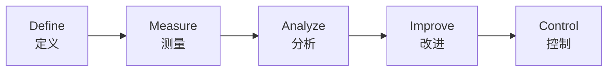
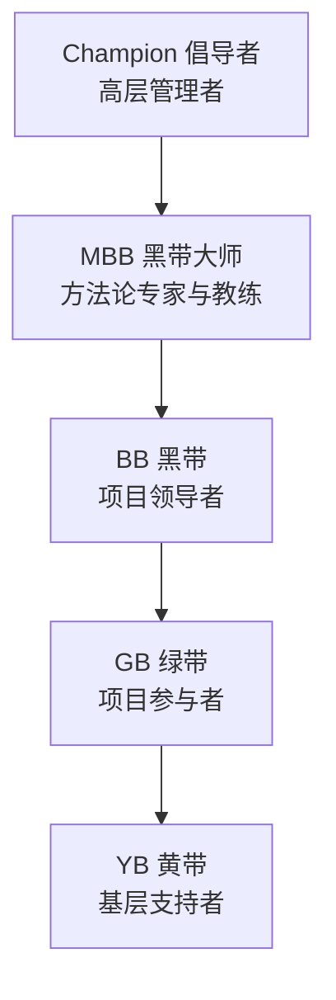

# 六西格玛（Six Sigma）

六西格玛是一套系统化的质量管理方法论，旨在通过减少过程变异和缺陷来提升质量。它由摩托罗拉（Motorola）在 1986 年提出，后被通用电气（GE）等企业广泛应用。

## 六西格玛的统计学含义

### 什么是"西格玛"？

西格玛（σ）是统计学中的标准差，衡量过程的变异程度。**六西格玛**意味着过程的波动极小，使得规格限内包含了 ±6 个标准差的区间。

### 3.4 DPMO 的由来

在考虑过程偏移（通常取 ±1.5σ 偏移）后：

| 西格玛水平 | DPMO（每百万机会缺陷数） | 良率 |
|-----------|------------------------|------|
| 1σ | 697,672 | 30.23% |
| 2σ | 308,770 | 69.13% |
| 3σ | 66,807 | 93.32% |
| 4σ | 6,210 | 99.38% |
| **5σ** | **233** | **99.977%** |
| **6σ** | **3.4** | **99.99966%** |

> **六西格玛 = 3.4 DPMO**，即每百万次机会中仅有 3.4 个缺陷，良率高达 99.99966%。

### 计算公式

```
DPMO = (缺陷数 ÷ (产品数 × 每产品机会数)) × 1,000,000
```

### 西格玛水平 vs 合格率

西格玛水平与合格率的关系（考虑 1.5σ 偏移）：

```
Z_bench = Z_st + 1.5
```
其中 Z_st 是短期西格玛水平，Z_bench 是长期（含偏移）的基准水平。

## DMAIC 方法论

DMAIC 是六西格玛改进项目的核心流程，包含五个阶段：



### 1. 定义（Define）

**目标**：明确问题、项目目标和顾客需求。

**关键工具**：
- 项目章程（Project Charter）
- SIPOC 图（供方-输入-过程-输出-顾客）
- Kano 模型
- CTQ（关键质量特性）树

### 2. 测量（Measure）

**目标**：收集当前过程数据，建立基线。

**关键工具**：
- 过程流程图
- 数据收集计划
- MSA（测量系统分析）
- 过程能力分析（CP/CPK）

### 3. 分析（Analyze）

**目标**：识别根本原因，验证关键影响因子。

**关键工具**：
- 因果图（鱼骨图）
- 5 Why 分析法
- 假设检验（t 检验、F 检验、卡方检验）
- 方差分析（ANOVA）
- 回归分析
- FMEA

### 4. 改进（Improve）

**目标**：制定和实施改进方案，验证效果。

**关键工具**：
- DOE（实验设计）
- 防错（Poka-Yoke）
- 标杆分析（Benchmarking）
- 方案优先级矩阵

### 5. 控制（Control）

**目标**：保持改进成果，实现标准化。

**关键工具**：
- 控制图（SPC）
- 控制计划（Control Plan）
- 标准化作业指导书
- 培训与交接
- 项目移交报告

### DMAIC 各阶段常用工具汇总

| 阶段 | 关键输出 | 常用工具 |
|------|---------|---------|
| D | 项目章程、SIPOC、CTQ | 头脑风暴、SIPOC、Kano 模型 |
| M | 基线数据、过程能力报告 | MSA、控制图、CPK 分析 |
| A | 根本原因列表、假设检验 | 鱼骨图、FMEA、回归分析、ANOVA |
| I | 改进方案、试点结果 | DOE、防错、FMEA 更新 |
| C | 控制计划、监控系统 | SPC、控制计划、标准化作业 |

## DMADV / DFSS

除了 DMAIC，还有面向六西格玛设计（DFSS）的 **DMADV** 方法论：

- **D**efine — 定义设计目标
- **M**easure — 测量顾客需求
- **A**nalyze — 分析设计概念
- **D**esign — 设计详细方案
- **V**erify — 验证设计性能

> 选择原则：**DMAIC** 用于改进现有过程，**DMADV/DFSS** 用于设计新产品或新过程。

## 六西格玛角色体系

六西格玛的推行需要明确的分工与角色体系：



### 各角色职责

| 角色 | 英文 | 级别 | 典型职责 |
|------|------|------|---------|
| **倡导者** | Champion | 高层 | 制定战略方向，分配资源，消除障碍，审批项目 |
| **黑带大师** | MBB | 专家级 | 培训黑带/绿带，制定方法论标准，指导复杂项目 |
| **黑带** | BB | 高级 | 全职领导六西格玛项目，使用高级统计工具 |
| **绿带** | GB | 中级 | 兼职参与项目，掌握基本工具，协助黑带 |
| **黄带** | YB | 入门 | 了解基本概念，参与数据收集和改善活动 |

### 培训时长参考

| 角色 | 培训时长 | 项目要求 |
|------|---------|---------|
| 黄带（YB） | 1–2 天 | 不强制要求项目 |
| 绿带（GB） | 10–14 天（分散） | 1 个改进项目 |
| 黑带（BB） | 20–25 天（分散） | 2–3 个复杂项目 |
| 黑带大师（MBB） | 经验积累 + 认证 | 指导多个 BB 项目 |

## 六西格玛实施的成功要素

1. **高层领导支持** — Champion 的承诺是项目成功的前提
2. **数据驱动决策** — 用数据说话，而非凭经验判断
3. **项目选择恰当** — 项目应与业务目标对齐，范围适当
4. **团队协作** — 跨部门团队的力量
5. **持之以恒的文化** — 六西格玛是持续改进的文化变革

## 相关链接

- [精益生产](./lean-production)
- [ISO 9001 质量管理体系](./)
- [SPC 统计过程控制](/tools/spc)
- [FMEA 失效模式分析](/tools/fmea)
- [六西格玛绿带/黑带认证](/certification/six-sigma-belt)
- [CQE 认证备考](/certification/)
